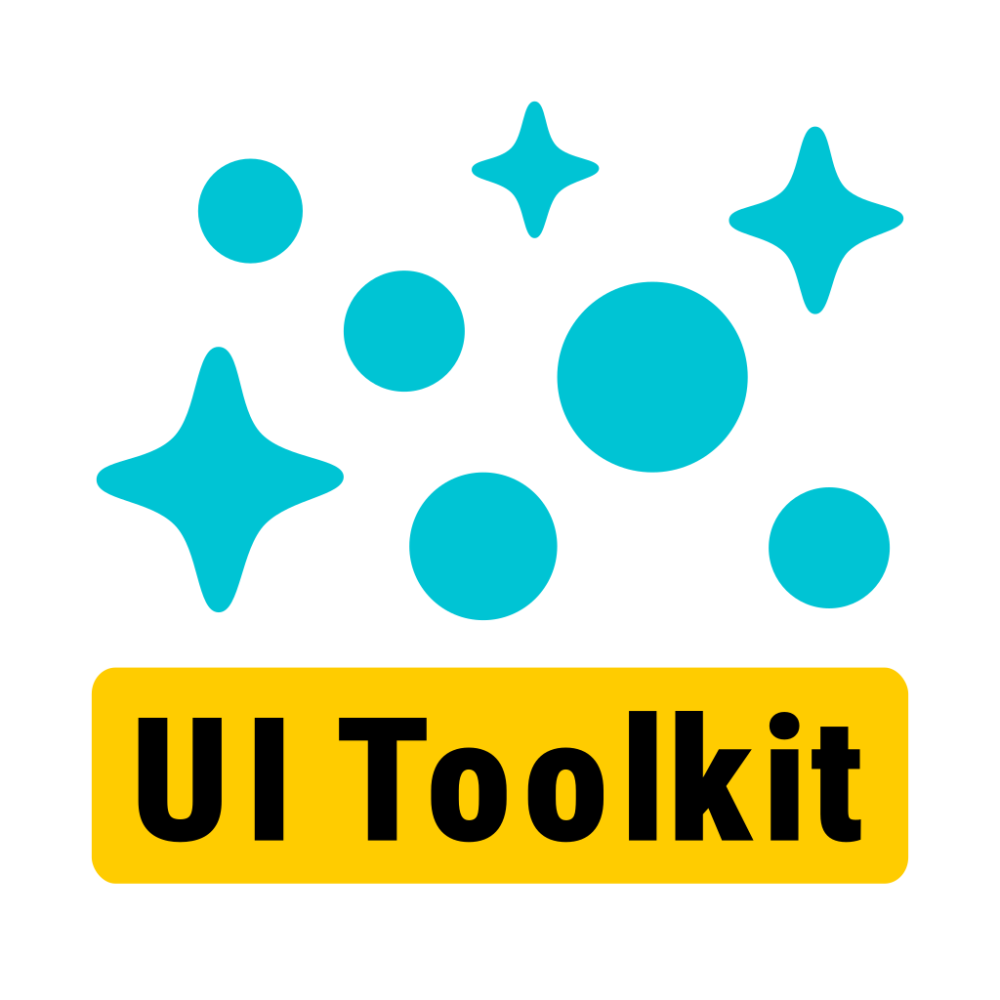

<p align="center">
<a href="#"></a>
</p>
<p align="center">
<a href="https://github.com/MainraStudio/UI-Toolkit-Particle-System/releases"></a>
<a href="https://openupm.com/packages/com.mainragames.uitoolkit-particlesystem/"></a>
<a href="https://github.com/MainraStudio/UI-Toolkit-Particle-System/blob/master/LICENSE"></a>
<!-- <a href="https://github.com/MainraStudio/UI-Toolkit-Particle-System/releases/latest"></a> -->
<a href="https://discord.gg/zreAsusu25"></a>
<a href="#"></a>
</p>
<p align="center">
<b>UIToolkit ParticleSystem</b> enables you to create ParticleSystem in the Unity UIBuilder.
</p>

## Features
<details>
<summary>Can extract existing particle systems</summary>
</details>
<details>
<summary>Easy to edit with UIBuilder</summary>
</details>

## Requirements
| **Name** | **Version** |
| --- | --- |
| Unity | `>= 2021.2` |
| [Alchemy](https://github.com/annulusgames/Alchemy) | `>= 2.1.0` |

## Installation
- **Using Open UPM**
  <details>
  <summary>Install via Package Manager</summary>
    
  - Open **`Edit > Project Settings > Package Manager`**
  - Add a new Scoped Registry (or edit the existing OpenUPM entry)

    | | |
    | --- | --- |
    | **Name** | `package.openupm.com` |
    | **URL** | `https://package.openupm.com` |
    | **Scope(s)** | `com.annulusgames.alchemy` |
    | | `com.mainragames.uitoolkit-particlesystem` |
  - Click **`Apply`**
  - Open **`Window > Package Management > Package Manager`**
  - Click **`+`**
  - Select **`Install package by name...`**
  - Paste **`com.mainragames.uitoolkit-particlesystem`** into **Name**
  - Click **`Install`**
  </details>
  <details>
  <summary>Install via Packages</summary>

    - Merge the snippet to [Packages/manifest.json](https://docs.unity3d.com/Manual/upm-manifestPrj.html)
      ```json
      {
          "scopedRegistries": [
              {
                  "name": "package.openupm.com",
                  "url": "https://package.openupm.com",
                  "scopes": [
                      "com.annulusgames.alchemy",
                      "com.mainragames.uitoolkit-particlesystem"
                  ]
              }
          ],
          "dependencies": {
              "com.mainragames.uitoolkit-particlesystem": "1.0.0"
          }
      }
      ```
  </details>
  <details>
  <summary>Install via command-line</summary>
    
    ```console
    $ openupm add com.mainragames.uitoolkit-particlesystem
    ```
  </details>
- **Using Git URL**
  <details>
  <summary>Install via Package Manager</summary>
    
  - Open **`Edit > Project Settings > Package Manager`**
  - Click **`+`**
  - Select **`Install package from git URL...`**
  - > (Optional) if you haven't installed [Alchemy](https://github.com/annulusgames/Alchemy), Enter the following URL First:
    ```
    https://github.com/annulusgames/Alchemy.git?path=/Alchemy/Assets/Alchemy
    ```
  - Enter the following URL:
    ```
    https://github.com/MainraStudio/UI-Toolkit-Particle-System.git?path=Packages/UIToolkitParticleSystem
    ```
  - Click **`Install`**

  </details>
  <details>
  <summary>Install via Packages</summary>

  - Merge the snippet to [Packages/manifest.json](https://docs.unity3d.com/Manual/upm-manifestPrj.html)
    ```json
    {
        "dependencies": {
            "com.mainragames.uitoolkit-particlesystem": "https://github.com/MainraStudio/UI-Toolkit-Particle-System.git?path=Packages/UIToolkitParticleSystem"
        }
    }
    ```
   - > (Optional) if you haven't installed [Alchemy](https://github.com/annulusgames/Alchemy)
      ```json
      {
          "dependencies": {
              "com.annulusgames.alchemy": "https://github.com/annulusgames/Alchemy.git?path=/Alchemy/Assets/Alchemy"
          }
      }
      ```
  </details>
